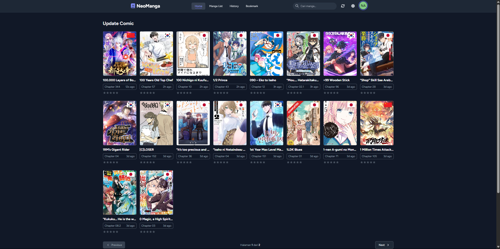

# NeoManga - A Modern Web Reader for Manga & Comics



<p align="center">
  
  
  
  
  
</p>

**NeoManga** adalah aplikasi web elegan dan modern, dibangun dengan Laravel + Blade, untuk membaca manga, manhwa, manhua, dan webtoon. Antarmuka bersih, desain responsif **dark-first** (dengan toggle mode terang), fitur berpusat pada pengguna.

## 🌐 Live

- **GitHub Pages (landing statis):** [`https://barastrong.github.io/BackendNeoManga/`](https://barastrong.github.io/BackendNeoManga/)

> Catatan: aplikasi ini Laravel (PHP + MySQL + Cloudinary) — butuh runtime server. GitHub Pages hanya bisa hosting file statis, jadi workflow `pages.yml` men-deploy landing statis sebagai placeholder. Untuk versi penuh, jalankan lokal (lihat Instalasi) atau deploy ke VPS/Platform-as-a-Service dengan dukungan PHP.

## ✨ Fitur Utama

- **Desain Modern & Responsif**: Dark-first, CSS native (tanpa framework CSS), aksesibel di semua perangkat.
- **Mode Terang & Gelap**: Toggle tema dark/light, tersimpan di localStorage, anti-flash saat load.
- **Katalog Manga Komprehensif**: Perpustakaan luas (100+ judul via scraper), dapat dicari & difilter.
- **Kategori & Genre**: Sistem genre & kategori terorganisir (60+ genre), dikelola dari admin.
- **Akun Pengguna**: Registrasi + verifikasi **OTP via email**, login, profil, bookmark, riwayat baca.
- **Reader yang Dioptimalkan**: Mode baca vertikal untuk webtoon/manhwa, progress bar.
- **Panel Admin Lengkap**: Dashboard statistik, manajemen Manga / Chapter / Kategori, moderasi komentar, manajemen user & ban.
- **Scraper Kiryuu**: Import otomatis manga & chapter dari sumber eksternal (di `Documents/kiryu`).
- **SEO-Friendly**: Struktur URL bersih, meta tags.

## 🚀 Teknologi

- **Backend**: Laravel, PHP 8.3
- **Frontend**: Blade, **CSS native** (`public/css/app.css` ~79KB, dark-first dengan `html.dark`), Alpine.js (sebagian view admin)
- **Database**: MySQL / MariaDB
- **Media**: Cloudinary (penyimpanan gambar chapter)
- **Tooling**: Composer, Vite (build aset), Git

## 📁 Struktur Folder

```
resources/views/          → hanya file .blade.php (HTML/markup + syntax Blade)
public/css/app.css        → CSS global + utility (dark-first, html.dark)
public/css/<folder>/      → CSS spesifik per view (dipisah dari blade)
public/js/<folder>/       → JS spesifik per view (dipisah dari blade)
routes/  app/  config/    → struktur standar Laravel
.github/workflows/        → GitHub Actions (deploy GitHub Pages)
```

Semua `<style>`/`<script>` inline sudah dipindah ke `public/css/<folder>/` dan `public/js/<folder>/` mengikuti struktur view aslinya. Satu-satunya pengecualian: `resources/views/emails/otp-verification.blade.php` tetap inline — email client (Gmail/Outlook) memblokir CSS eksternal.

## 🛠️ Instalasi & Setup Lokal

**Prasyarat:** PHP 8.3, Composer, Node.js & NPM (hanya untuk build aset), MySQL/MariaDB — atau [Laragon](https://laragon.org) (Windows) yang memuat semuanya.

```bash
git clone https://github.com/barastrong/BackendNeoManga.git
cd BackendNeoManga
composer install
cp .env.example .env
php artisan key:generate
# atur DB_CONNECTION/DB_HOST/DB_PORT/DB_DATABASE/DB_USERNAME/DB_PASSWORD di .env
php artisan migrate --seed
npm install
npm run build
php artisan serve
```

Aplikasi tersedia di `http://127.0.0.1:8000`.

> Jika memakai Laragon, akses via `http://backendneomanga.test`.

### Setup email OTP (verifikasi registrasi)

Isi kredensial SMTP di `.env`:

```
MAIL_MAILER=smtp
MAIL_HOST=smtp.gmail.com
MAIL_PORT=587
MAIL_USERNAME=email@gmail.com
MAIL_PASSWORD=app_password  # App Password Gmail, bukan password biasa
MAIL_ENCRYPTION=tls
```

Untuk pengembangan cepat tanpa SMTP: set `MAIL_MAILER=log` — kode OTP akan ditulis ke `storage/logs/laravel.log`.

### Scraper Kiryuu (import otomatis)

Scraper ada di folder terpisah (bukan bagian repo ini):

```bash
cd Documents/kiryu
./kiryuu-venv/Scripts/python.exe kiryuu_scraper.py --start 1 --pages 5
```

> Butuh server API NeoManga berjalan (`php artisan serve` di port 8000). Scraper menembak `127.0.0.1:8000/api` untuk import manga & chapter. Detail operasional ada di skill `neomanga-ops`.

## 🚀 Deploy

### GitHub Pages (landing statis)

Push ke branch `main` memicu `.github/workflows/pages.yml` → men-deploy halaman statis ke `https://barastrong.github.io/BackendNeoManga/`. Karena Laravel butuh PHP runtime, ini halaman placeholder, bukan aplikasi penuh.

### Aplikasi penuh (VPS / PaaS)

Laravel butuh runtime PHP + MySQL + Cloudinary. Deploy ke VPS (mis. Laragon di Windows, Forge, atau platform PHP PaaS). Tidak ada konfigurasi Vercel di repo ini.

## 🗺️ Roadmap

- [x] Sistem Komentar pada Chapter
- [x] Riwayat Baca
- [x] Verifikasi OTP via email
- [x] Panel Admin lengkap (Manga, Chapter, Kategori, Moderasi, User)
- [ ] Peringkat & Ulasan Manga
- [ ] Notifikasi Chapter Baru
- [ ] Dukungan Multi-bahasa
- [ ] API untuk aplikasi pihak ketiga

## 🤝 Berkontribusi

1. Fork repositori ini
2. Buat branch baru (`git checkout -b feature/FiturBaru`)
3. Commit perubahan (`git commit -m 'Menambahkan FiturBaru'`)
4. Push ke branch (`git push origin feature/FiturBaru`)
5. Buka Pull Request

## 📝 Lisensi

Proyek ini dilisensikan di bawah [MIT License](LICENSE.md).

---

Dibuat dengan ❤️ oleh barastrong
